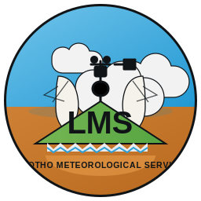

# CSIS Documentation Portal

  
  

    <strong>Lesotho Meteorological Services</strong>
    
Operational documentation for the Climate Services Information System, presented in a calm LMS-aligned visual style for everyday institutional use.

  

Welcome to the **Climate Services Information System (CSIS)** documentation portal.

This site contains:

- User guidance for day-to-day platform usage
- System administration guidance
- operational workflows integrated into the User Guide
- Reference material for rollout, support, and maintenance

## Main sections

### User Guide
Guidance for forecasters, reviewers, sector contributors, approvers, and dissemination users. This section also includes operational workflows for recurring product tasks.

### System Administration
Guidance for installation, configuration, maintenance, backup, and troubleshooting.

## Documentation scope

This documentation portal is intended to support:

- onboarding of new users
- structured training and refresher sessions
- operational continuity
- system maintenance and handover
