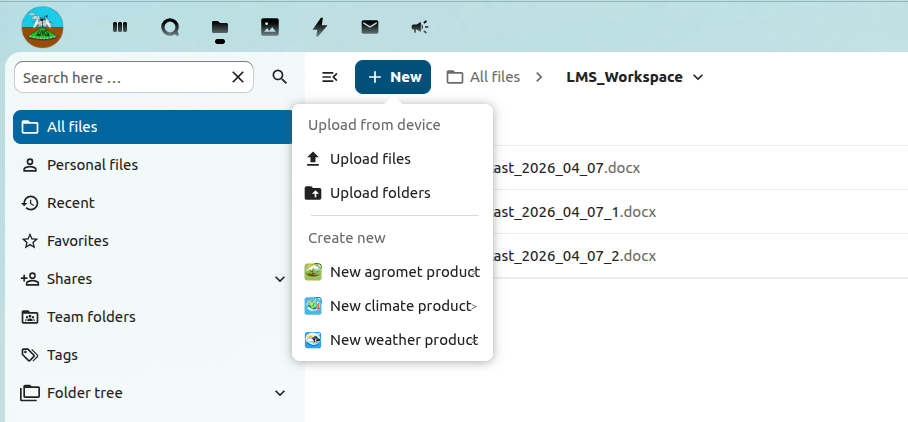

# Forecast Workflow

This section describes the standard workflow for preparing, discussing, reviewing, and approving forecast products in the CSIS Collaboration Interface.

It is intended for operational users involved in forecast production, especially `Forecasters` and `Head of Operations/Director` approvers.

## Workflow contents

  <a class="workflow-card" href="#before-you-begin">
    
    

      <strong>Before you begin</strong>
      
Confirm access, product context, templates, and workflow roles.

    

  </a>
  <a class="workflow-card" href="#create-a-product">
    
    

      <strong>Create a product</strong>
      
Prepare a new draft using the correct folder, product type, and template.

    

  </a>
  <a class="workflow-card" href="#conduct-a-weather-discussion">
    
    

      <strong>Conduct a weather discussion</strong>
      
Collaborate on the draft and agree on the final operational position.

    

  </a>
  <a class="workflow-card" href="#request-product-approval">
    
    

      <strong>Request product approval</strong>
      
Submit the finalized draft for formal approval.

    

  </a>
  <a class="workflow-card" href="#approve-or-reject-a-product">
    
    

      <strong>Approve or reject</strong>
      
Review, approve, or return the product with corrective feedback.

    

  </a>
  <a class="workflow-card" href="#good-practice">
    
    

      <strong>Good practice</strong>
      
Maintain consistency, traceability, and operational quality.

    

  </a>

## Before you begin

Before starting the workflow, confirm that you:

- have valid CSIS login credentials
- know which folder or workspace should contain the product
- have selected the correct product type and template
- understand your role in the review and approval process

It is good practice to confirm the daily operational schedule, expected product release time, and any supporting observations or datasets required before drafting begins.

## Create a product

Role: `Forecaster`

Use this procedure to create a new weather or climate service product from an approved template.

1. Log in to the CSIS Collaboration Interface at `https://ibf.csis.gov.ls/` using your username and password.
2. From the main menu, select `File`.
3. In the directory structure, open the folder where the new product should be created.
4. Under the `Files` submenu, select `+ New`.
5. Choose the required product type, such as a weather product, agrometeorological bulletin, or climate service product.
6. Select the appropriate template from the available template options.
7. When the template opens, complete the required fields with the new product information.
8. Review the content for accuracy and completeness.
9. Save the product.

### Output expectations

At this stage, the product should:

- be saved in the correct operational folder
- use the approved template and naming convention
- contain complete draft content for internal review
- be ready for collaborative discussion or refinement

## Conduct a weather discussion

Role: `Forecaster`

Use this procedure when a draft forecast needs collaborative discussion before it is submitted for approval.

1. Log in to the CSIS Collaboration Interface at `https://ibf.csis.gov.ls/`.
2. Open the draft forecast product that will be discussed.
3. Select the communication channel to use for the discussion, such as `Talk` instant messaging or `Talk` video call.
4. Start and conduct the weather discussion with the relevant participants.
5. Update the draft forecast collaboratively during the discussion, as required.
6. Confirm agreement on the final draft before moving it to the approval stage.
7. Save any changes made during the discussion.

> Screenshot placeholder: Draft forecast open in the collaboration workspace with Talk messaging or video call options visible.

### Discussion focus

The discussion should normally confirm:

- the main forecast message and expected impacts
- consistency between maps, text, and supporting evidence
- whether any wording requires clarification before approval
- whether all required contributors have reviewed their sections

## Request product approval

Role: `Forecaster`

After the forecast draft has been finalized internally, request formal approval from the designated approver.

1. Log in to the CSIS Collaboration Interface at `https://ibf.csis.gov.ls/`.
2. Navigate to the product file that is ready for approval.
3. Right-click the product document and select `Request Approval`.
4. Confirm that the product status changes to show that approval is pending.

> Screenshot placeholder: Product file context menu with Request Approval selected and the product status showing approval pending.

### Before submitting

Before requesting approval, confirm that:

- the draft reflects the final agreed forecast position
- formatting and spelling have been checked
- any required attachments or supporting references are included
- the correct approver is responsible for the product

## Approve or reject a product

Role: `Head of Operations/Director`

Use this procedure to review submitted products and either approve them for the next step or return them for correction.

1. Log in to the CSIS Collaboration Interface at `https://ibf.csis.gov.ls/`.
2. Open the notifications area in the top-right corner of the home page.
3. Review the list of product approval requests assigned to you.
4. Select the product that you want to review.
5. Review the product content and confirm that it is complete and acceptable.
6. Select `Approve` to approve the product, or select `Reject` to return it for further edits.

> Screenshot placeholder: Notifications panel showing approval requests and the product review screen with Approve and Reject actions.

### Approval decision guidance

An approver should verify:

- technical correctness and consistency of the forecast message
- clarity of language for the intended audience
- compliance with operational and institutional standards
- readiness for publication or dissemination

If a product is rejected, feedback should clearly identify what must be corrected before resubmission.

## Good practice

- Use the correct template for each product type.
- Save changes regularly during drafting and discussion.
- Confirm the product status before proceeding to the next workflow stage.
- Return rejected products with clear feedback so revisions can be made efficiently.
- Keep records of significant changes made during review and approval.
